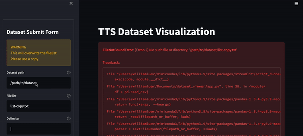

# TTS Dataset Viewer

## Visualize, find errors, and edit your TTS datasets



Easily find and edit repeated words and words not in CMU dictionary.

### Installation

- Install dependencies

```bash
pip install streamlit st-annotated-text pandas
```

- Install forked g2p repo:

```bash
pip install g2p_en@git+https://github.com/uberduck-ai/g2p@will-add-lookup-results
```

- Clone this repo:

```bash
git clone git@github.com:uberduck-ai/dataset_viewer.git
```

- Run the app

```bash
cd dataset_viewer
streamlit run app.py
```

## Usage Instructions

- Run the app: `streamlit run app.py`
- Enter the dataset information in the sidebar on the left
- NOTE: Please make a copy of the filelist... edits with this app will overwite the provided filelist
- Select `Visualize` in the form and the dataset will populate the main screen

### Editing

- Select the `Edit` checkbox
- Make the desired edits in the textbox that pops up
- Save the edits by pressing `Submit`
- Unselect the `Edit` checkbox to see the edits and hide the editing widgets
